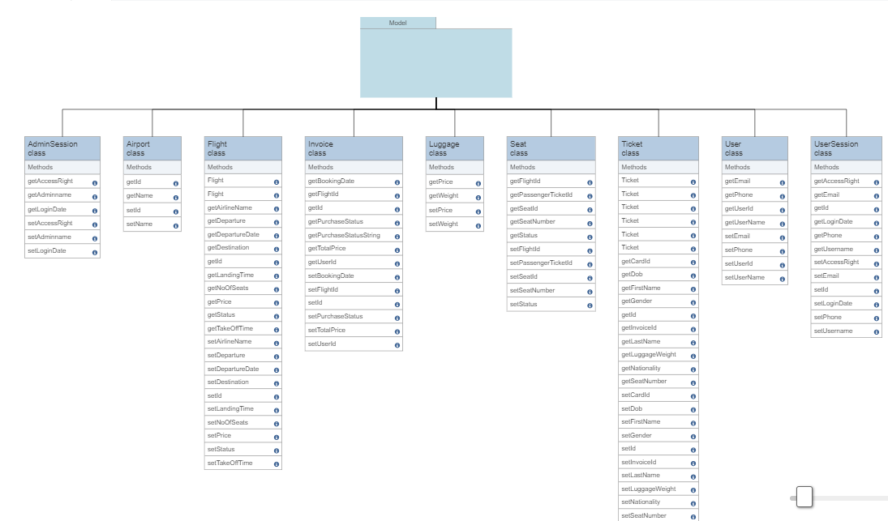
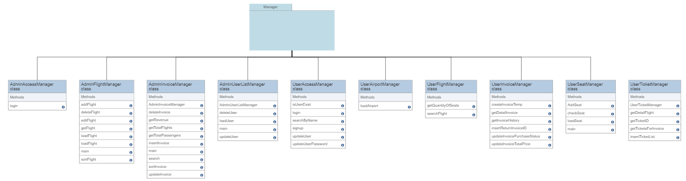
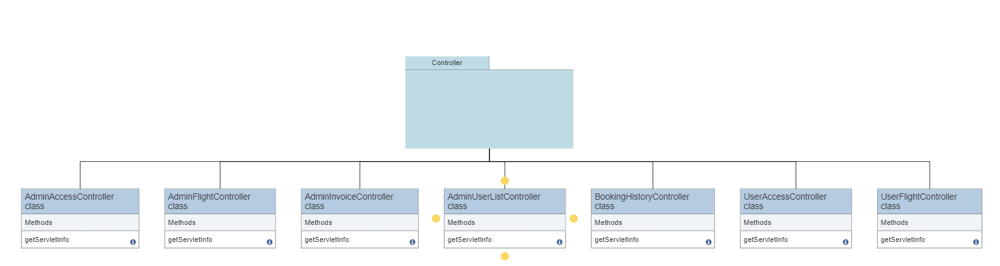

## 

---

## **Group:**

1. Nguyễn Bá Huy - SE173020
2. Nguyễn Thanh Duy - SE173204
3. Nguyễn Hưng Hải - SE173100
4. Lê Trung Đức - SE173043

---

# 1. Requirements:

- **_System name:_** VnFlight.

- **_Purpose:_**

  - VnFlight is a website that provides the service for booking domestic flight tickets.

- **_Objects:_**

  - Users book ticket for one or many passengers.
  - Admins manage the system of flights, users, invoices.

- **_Features:_**

  - **User:**

    a. Login:

    - Login as user. (if you are admin, login as admin).
    - Create new user account.

    b. Account:

    - View and edit user account information.
    - Change user account password.

    c. Search flights:

    - Searh all flights having the same departure point, landing point and departure date.

    d. Flight booking + Seat selection:

    - Select one flight for booking (log-in necessity).
    - Fill in passenger ticket information, select seat for each passenger (required) and choose luggage weight (optional).
    - Fill in next ticket for "more than one" passengers by clicking "Save" button.
    - Show total price after providing passenger tickets' information.
    - Confirm buying ticket(s) by clicking "Purchase" or Add to Cart without purchase.

    e. Booking history:

    - View your booking history.
    - Confirm purchase for saved invoices.

  - **Admin:**

    a. Manage flights:

    - View flights.
    - Filter flights by airlines, departure points or landing points.
    - Add, edit, remove flights.

    b. Manage users:

    - View users.
    - Add, edit, remove users.

    c. Manage invoices:

    - View invoices.
    - Calculate revenue.

---

# 2. Wireframe:

- ## Sitemap:
  
- ## User wireframe:
  1. **Home:**
  2. **Login:**
  3. **Create user account:**
  4. **Account information:**
  5. **Change password:**
  6. **Search flights:**
  7. **Flight details:**
  8. **Passenger ticket information, seat selection and purchase:**
  9. **Booking history:**
- ## Admin wireframe:
  1. **Login as admin:**
  2. **Admin Homepage:**
  3. **Flight management:**
  4. **User management:**
  5. **Invoice management:**

---

# 3. Database design:

- **ERD:**
  

---

# 4. System design:

- **Model:**
  
- **Manager:**
  
- **Controller:**
  
- **Util:**
  

# 5. Conclusion:

Building a project like VnFlight taught us several valuable lessons:

1. **Project organization:** Developing a large-scale web application requires careful planning and organization. This project can help us understand how to structure our codebase, manage dependencies, and handle version control using tools like Git and Maven.

2. **User experience design:** VnFlight's success largely depends on its user experience design. This project can help us learn how to create a user-friendly interface, and simplify the booking process to enhance the overall user experience.

3. **Booking ticket management:** VnFlight's feature of booking tickets is a critical part of the system. Building this feature can teach us how to design an efficient system for booking tickets, how to handle ticket availability and reservation conflicts, and how to integrate ticket booking with the seat selection process. We can also learn how to calculate the total price of a booking, handle purchase processing, and generate invoices for customers. Additionally, we can learn about seat selection and management, such as how to handle seat availability and conflicts, how to display seat maps to customers, and how to integrate seat selection with the ticket booking process.

4. **Database management:** Storing and managing large volumes of data is critical to the success of any web application. By building VnFlight, we can learn how to design a database schema, connect to a database using JDBC, and manage data using SQL queries.

5. **Teamwork:** Building a project like VnFlight requires a collaborative effort from a team of developers. In real-life scenarios, working with a team of 4 people on a project like this can help us learn how to communicate effectively, delegate tasks, manage conflicts, and maintain a consistent coding style and project structure. In addition, using a version control system like Git and hosting the project on Github can help us learn how to collaborate efficiently and effectively.

Overall, building a project like VnFlight can help us gain valuable skills and insights into project management, user experience design, database management, seat booking systems, and teamwork.
