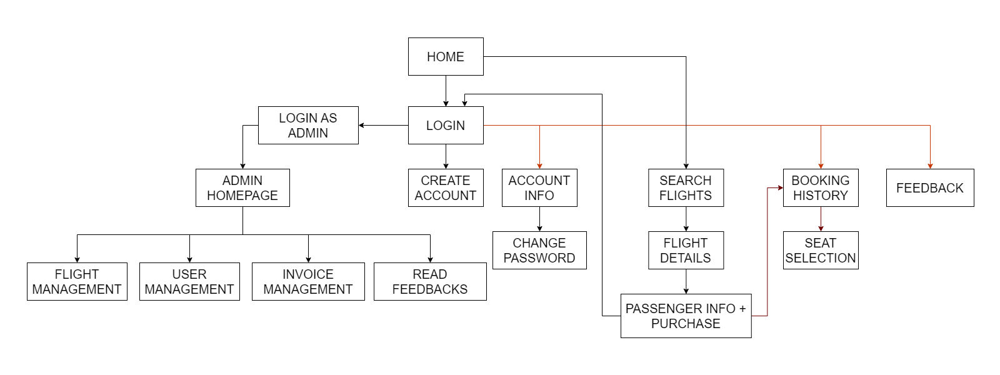
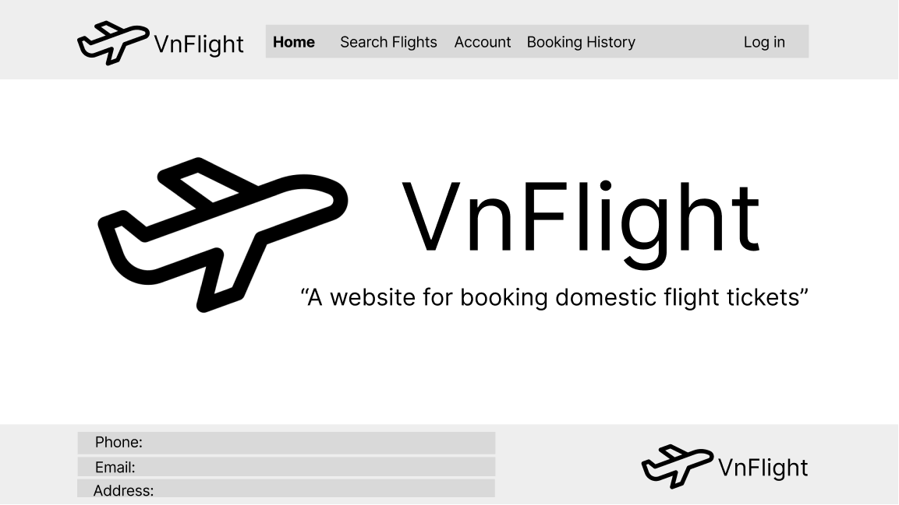
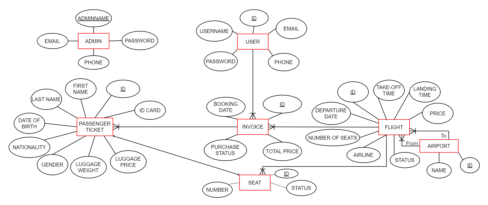

## 

---

## **Group:**

1. Nguyễn Bá Huy - SE173020
2. Nguyễn Thanh Duy - SE173204
3. Nguyễn Hưng Hải - SE173100
4. Lê Trung Đức - SE173043

---

# 1. Requirements:

- **_System name:_** VnFlight.

- **_Purpose:_**

  - VnFlight is a website that provides the service for booking domestic flight tickets.

- **_Objects:_**

  - Users book ticket for one or many passengers.
  - Admins manage the system of flights, users, invoices.

- **_Features:_**

  - **User:**

    a. Login:

    - Login as user. (if you are admin, login as admin).
    - Create new user account.

    b. Account:

    - View and edit user account information.
    - Change user account password.

    c. Search flights:

    - Searh all flights having the same departure point, landing point and departure date.
    - Filter flights using price range, departure time in four day sessions and different airlines.
    - Sort flights by ascending price, earliest take-off time, latest take-off time.

    d. Flight booking + Seat selection:

    - Select one flight for booking.
    - Fill in passenger ticket information, select seat for each passenger (required) and choose luggage weight (optional).
    - Buy ticket for "more than one" passengers by clicking "Add Passenger Ticket" button.
    - Show total price after providing passenger tickets' information.
    - Confirm buying ticket(s) by clicking "Purchase" (log-in necessity) or Save without purchase.

    e. Booking history:

    - View your booking history.
    - Confirm purchase for saved invoices.
    - Edit passenger ticket information.

  - **Admin:**

    a. Manage flights:

    - View flights.
    - Filter flights by airlines, departure points or landing points.
    - Add, edit, remove flights.

    b. Manage users:

    - View users.
    - Add, edit, remove users.

    c. Manage invoices:

    - View invoices.
    - Calculate revenue in day, month or year.

---

# 2. Wireframe:

- ## Sitemap:
  
- ## User wireframe:
  1. **Home:**
  2. **Login:**
  3. **Create user account:**
  4. **Account information:**
  5. **Change password:**
  6. **Search flights:**
  7. **Flight details:**
  8. **Passenger ticket information, seat selection and purchase:**
  9. **Booking history:**
- ## Admin wireframe:
  1. **Login as admin:**
  2. **Admin Homepage:**
  3. **Flight management:**
  4. **User management:**
  5. **Invoice management:**

---

# 3. Database design:

- **ERD:**
  

---

# 4. System design:

---

# 5. Conclusion and Discussion:
